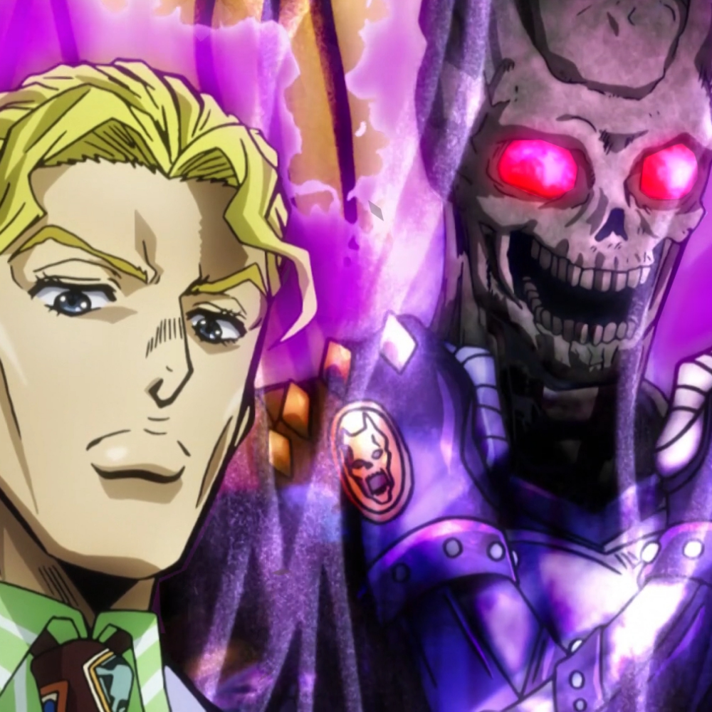

## les 4

# markdown en github leren

### drie hekjes

#### vier hekjes

##### vijf hekjes

##### In deze les heb ik geleerd hoe je moet updaten met git en hoe je de tekst kleiner en groter kan maken!

##### Zelf ga ik dit gebruiken zodat ik en mijn groepje de files die wij hebben gemaakt van ons project steeds weer wordt upgedated en dat wij dan goed met elkaar dan kunnen samen werken

<!DOCTYPE HTML>
<html>
<head>
   <title>Wide Putin</title>
   
</head>
<body>
    <h1>This has to work :D</h1>
    
</body>
</html>

##### Let the Bloodbath begin :D

#### Fade in

### Demolion: The Four Legends

## Warlock Games Studios

# Game Over

##### Springtraps

##### Pingas

##### *Another one bites the dust*	

## **This is bold text**